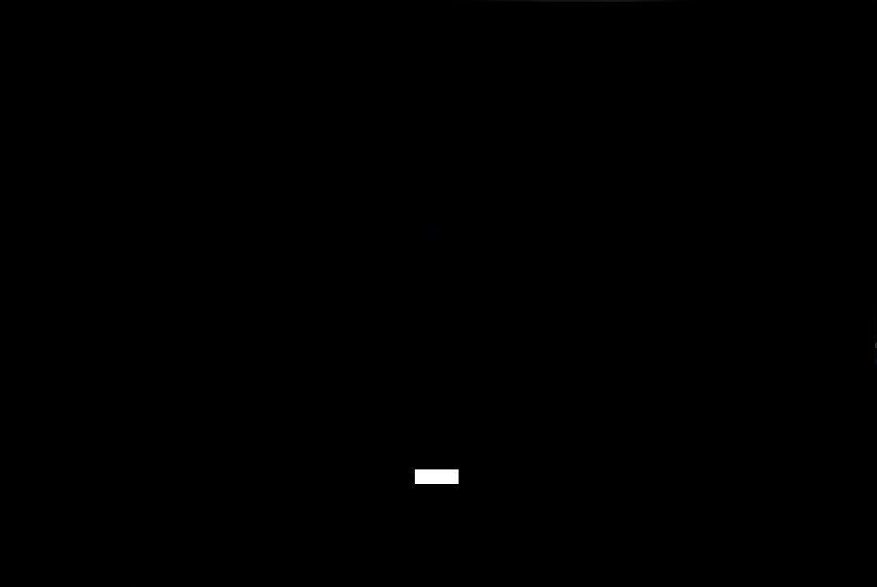
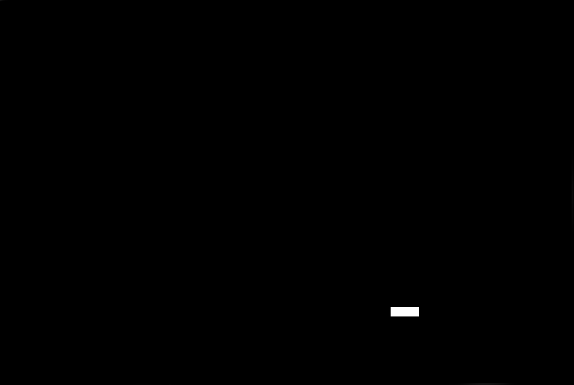
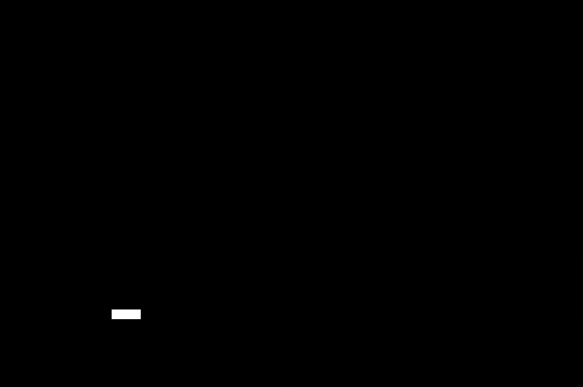
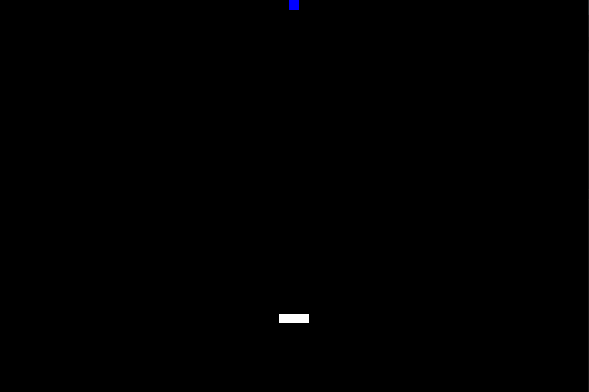
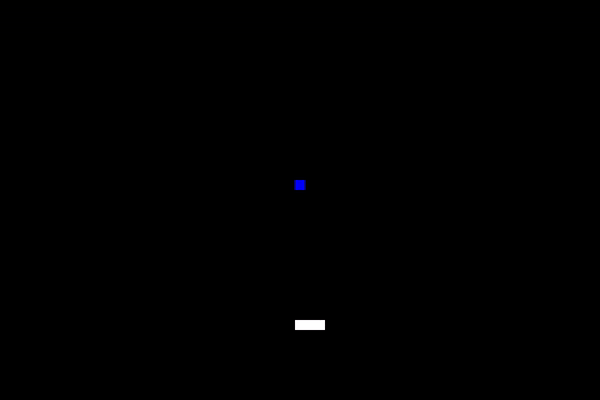

# LPOO_19 - Breakout

In this project we are gonna replicate the game Breakout where you are suposed to not let the ball fall below the screen before you destroy all the blocks on the upper part of the screen by hitting them with the ball.

(This link has edit permissions, be careful)
[UML Document](https://drive.google.com/file/d/1M48P9BENmmRgFDlytl21KWHs9SB5GJh9/view?usp=sharing)

This project was developed by Rafael Cristino @rafaavc (up201806680@fe.up.pt) and Xavier Pisco @Xavier-Pisco (up201806314@fe.up.pt) for LPOO 2019/20.

## Implemented features

### Draw player's bar 

The player's bar is being drawn close to the bottom of the screen and in the middle of width of the screen.

### Move player's bar

The player's bar is possible to move within the screen with the left and right arrows to move left and right respectively.

### Draw ball

The game's ball is being drawn and starts close in the middle of the width of the screen and a bit above the players bar.

### Move the ball

The ball will move with time. At the begin it will move up;

### Add ball colisions and bounces

The ball will start moving upwards and it will change it's direction according to it's collisions.

If it hits the top of the screen it will start moving down, if it hits the bottom it will stop (game over).
 If it hits the left or right side of the screen it will start going right or left, respectively.
 If it hits the player's bar it can go up, up and left or up and right.

## Design Patterns

So far, we've used the following design patterns in the development of our project:

- Adapter pattern (for the graphics interface with which the view interacts)

- Command pattern (for the commands comming from the keyboard input)

- MVC (for the arena and it's various elements; implementation is not yet finished)

## Planed Features

- [x] Draw the arena
- [x] Add the players bar
- [x] Move the bar
- [x] Add the ball
- [x] Move the ball 
- [x] Add ball colisions and bounces
- [x] Add the tiles
- [ ] Add colisions with tiles
- [ ] Add scoreboard

(these are just more ideas)
- [ ] Add shots coming from above to hurt the player
- [ ] Add special powers (for example: make the ball bigger for a few seconds, make the player bar bigger, increase/decrease the ball velocity)

## Design

TO-DO

