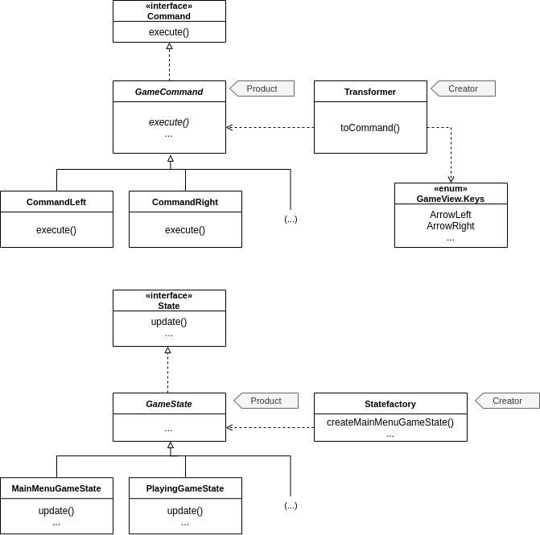
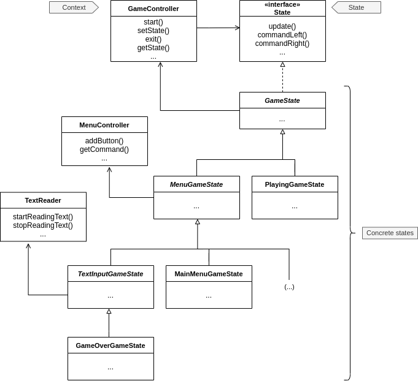
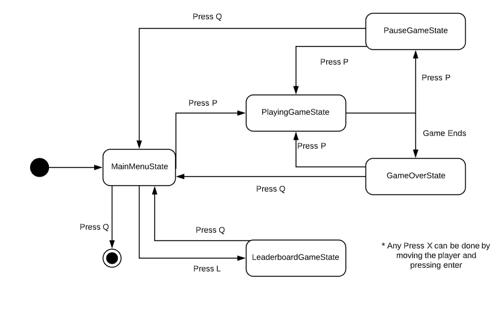
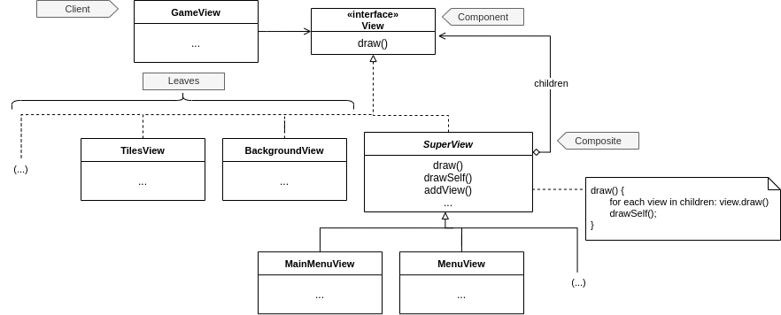
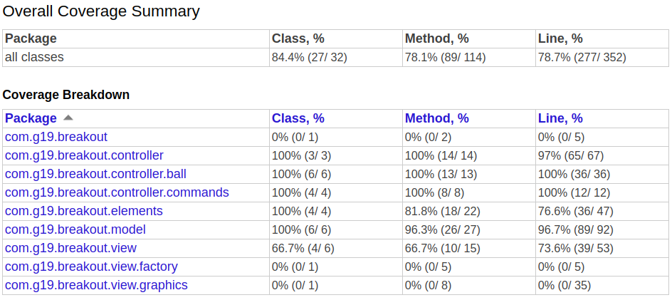
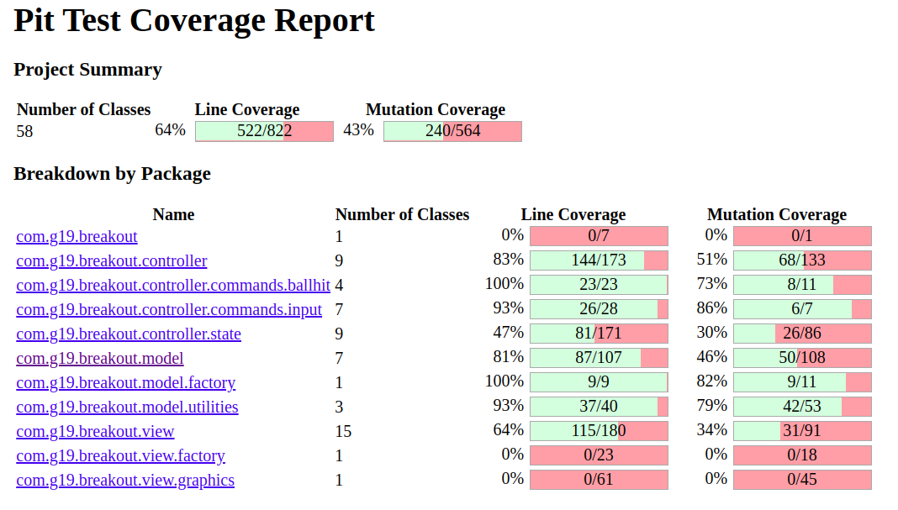

# LPOO_19 - Breakout

In this project we are created a game that looks a lot like "Breakout". The objective is to not let the ball fall below the screen before destroying all the blocks above (by hitting them with it).

This project was developed by Rafael Cristino (@rafaavc, up201806680@fe.up.pt) and Xavier Pisco (@Xavier-Pisco, up201806314@fe.up.pt) for LPOO 2019/20.

## Quickly jump between topics

***TO BE GENERATED BEFORE DELIVERING***

## Features

All of these features are evident in the [gif above](#lpoo_19---breakout).

### Player Bar 

The player's bar is being drawn close to the bottom of the screen and in the middle of width of the screen. 
It can be moved left or right by pressing the left or right arrows on the keyboard.

### Ball

The game's ball is being drawn and starts close in the middle of the width of the screen and a bit above the players bar.

The ball will move with time. In the begin it will move right up. The ball changes it's direction according to the collisions it suffers.

If the ball hits either the top of the screen, the sides of the screen, the player bar or the tiles it will bounce from that surface in the correct angle. However, if the ball hits the bottom of the screen, the game is over.

### Tiles

The tile grid is being generated and drawn and the collisions of the ball with the tiles are being checked. The color of the tiles depends on the amount of health they have. When a tile reaches 0 health it is removed.

### Scoreboard

The scoreboard is on the top of the screen while the game is playing. It displays the user's points. If the time between collisions with tiles is less than one second, the lesser the time more points one collision will give to the player.

### Menus

Implemented the main menu, pause menu, game over menu and leaderboard menu. The implementation of the menus was made using States, each state representing a menu (or the game).

### Leaderboard

Implemented the leaderboard, whose score list is read from a file, and to which the new scores are added at the end of a game.

### Other features that could be implemented (not implemented)

- Add player lives
- Add shots coming from above to hurt the player
- Add special powers (for example: make the ball bigger for a few seconds, make the player bar bigger, increase/decrease the ball velocity)

## Design

In this section we expose some of the problems we had to face and the design patterns (or not) we used to solve them.

---

### *We want to work in the different components without affecting one another and improve modularity*

#### The problem in context

As our architectural patern we decided to use the Model-View-Controller. With it we will have a more readable code since it will separate our code into 3 parts.

#### The pattern
- MVC - Model View Controller

#### Implementation

The classes can be found in these packages:
- [Model](../src/main/java/com/g19/breakout/model)
- [View](../src/main/java/com/g19/breakout/view)
- [Controller](../src/main/java/com/g19/breakout/controller)

#### Consequences

- Helps keeping the 1st SOLID principle.
- Shuns circular dependencies since the model doesn't need to know the existance of the view nor the controller and the view doesn't use the controller.
- Improves the separation of tasks.

---

### *We shouldn't need to interact directly with Lanterna to draw objects in the View*

#### The problem in context
The view shouldn't be interacting with the graphics directly. We don't want to have to worry about the specifics of the graphics library being used at the moment while writing the view of each component, therefore we needed to reccur to abstraction. This is also helpful if we want to have the possibility of changing the graphics library easily, while not having to worry about it in the view.

#### The pattern
We applied the **Adapter pattern**. This will enable us to have separate classes to deal with the graphics library used, while not having to worry about it while coding other features.

#### Implementation

The classes can be found in these files:
- [View](../src/main/java/com/g19/breakout/view)
- [Graphics](../src/main/java/com/g19/breakout/view/graphics/Graphics.java)
- [LanternaAdapter](../src/main/java/com/g19/breakout/view/graphics/LanternaAdapter.java)

#### Consequences
The use of the Adapter pattern in the current design allows for the following benefits:
- If we need to use another graphics we just need to create and use another adapter.
- Neither the model nor the view need to be changed in order to implement a new graphics.

---

### *We want to be able to inject the classes that the View and the Model need to create*

#### The problem in context
The ArenaView was instantiating objects like BallView, PlayerBarView, etc in its constructor. This made it impossible to inject these same classes into ArenaView and violated the Single Responsibility principle for this class (it was creating and drawing the classes). We need something that allows us to solve these issues. 
Like with the ArenaView, the ArenaModel was instantiating other models, with the same drawbacks. 

#### The pattern
To solve this problem, we applied the **Abstract Factory** pattern. With this pattern we can use a class to create the views and another to create the models.

#### Implementation

The classes in the diagram can be found in these files:
- [GameView](../src/main/java/com/g19/breakout/view/GameView.java)
- [ArenaView](../src/main/java/com/g19/breakout/view/ArenaView.java)
- [ViewFactory](../src/main/java/com/g19/breakout/view/factory/ViewFactory.java)
- [BasicViewFactory](../src/main/java/com/g19/breakout/view/factory/BasicViewFactory.java)  
- [GameModel](../src/main/java/com/g19/breakout/model/GameModel.java)
- [ArenaModel](../src/main/java/com/g19/breakout/model/ArenaModel.java)
- [ModelFactory](../src/main/java/com/g19/breakout/model/factory/ModelFactory.java)
- [BasicModelFactory](../src/main/java/com/g19/breakout/model/factory/BasicModelFactory.java)

#### Consequences

By using this design pattern:
- We can inject the factories into the classes that need to have other classes created, therefore there's the possibility of injecting the classes we want to inject.
- We remove the responsibility of instantiating classes from the classes whose responsibility isn't to do that.
- If we want we can create more implementations of the ViewFactory/ModelFactory interface to create the views/models differently.
- In the future, if we want to have alternate versions of the views we only need to implement a new factory for them and 'abstractify' the views (the same for the models).

---

### *We want to convert enum types to Commands and create States in a simple and clean way*

#### The problem in context

We wan't to maintain the MVC structure while the controller gets information about the view. We need the controller to know which key was pressed, and that's received by the view, but we want the controller to change that info into classes. 
We also want the states to be able to create other states, however without having to instantiate them (delegating that responsibility to other class).

#### The pattern
We used the **factory pattern** to solve this problem, creating a StateFactory (for the states) and a Transformer (for the commands).

#### Implementation

*Implementation for the controller commands received from the view*

The classes in the diagram can be found in these files:
- View:
  -  [GameView.Keys](../src/main/java/com/g19/breakout/view/GameView.java#L11)
- [Transfomer](../src/main/java/com/g19/breakout/controller/Transformer.java)
- [GameCommands](../src/main/java/com/g19/breakout/controller/commands/input)
- [States](../src/main/java/com/g19/breakout/controller/state)

#### Consequences

By using this design pattern in this case:
- The controller will easily convert the info received from the view and the model into classes used by it.
- Neither the view or the model will mess the MVC desing pattern already implemented.
- The states can create the next state without having to instantiate and configure it.

---

### *We want our controllers to not have to worry about which command was given nor which object the ball hit*

#### The problem in context

We want the ArenaController to execute a command, and update the ball's direction according to which Command and BallHit the transformer has returned, respectively

#### The pattern
- Command pattern (for the Commands comming from the keyboard input and for the BallHits)

#### Implementation

Those classes can be found here:
- [GameController](../src/main/java/com/g19/breakout/controller/GameController)
- [BallController](../src/main/java/com/g19/breakout/controller/BallController)
- [BallHits](../src/main/java/com/g19/breakout/controller/commands/ballhit)
- [GameCommands](../src/main/java/com/g19/breakout/controller/commands/input)
- [Command](../src/main/java/com/g19/breakout/controller/commands/Command.java)

#### Consequences

By using this pattern the ArenaController doesn't need to know which type of command it has, it know it has a command and tells it to execute and, depending on the class implementation of the command it will execute in a diferent way.

The same can be said to the BallHit abstract class, where it saves some attributes and has a constructor for all of its subclasses and has an abstract method to update the ball's direction.

---

### *We want to implement a state machine to change between menus*

### The problem in context

We have some menus and we need them to implement the same functions and change between them, one at a time.

### The pattern

We used the **State pattern** to solve that problem by having a interface and one class for each menu that implement that interface and that can easily change between them.

### Implementation

Those classes can be found here:
- [States](../src/main/java/com/g19/breakout/controller/state)
- [GameController](../src/main/java/com/g19/breakout/controller/GameController.java)

#### Consequences

This way we the controller only has an abstract object that has different subclasses and that way it doesn't need to know which is the current game screen, so, it has one less job.

Furthermore, the state knows how to handle any command and can update itself, and can set the controller state to the next one.

---

### *We want to be able to group views and group the grouped views into other views*

### The problem in context

For example, we have MenuButtonViews. We want to have also a MenuView, that groups the MenuButtonViews. However, we also want to have the MenuStateView, which groups the MenuView with other Views of the state.

### The pattern

To answer these requirements, we used the *Composite Pattern*. 

### Implementation

The classes in the diagrams can be found here:
- [View](../src/main/java/com/g19/breakout/view/View.java)
- [SuperView](../src/main/java/com/g19/breakout/view/SuperView.java)
- [MenuButtonView](../src/main/java/com/g19/breakout/view/MenuButtonView.java)
- [MenuView](../src/main/java/com/g19/breakout/view/MenuView.java)
- [All views](../src/main/java/com/g19/breakout/view)

### Consequences

- We can group various views in any way we want, while being able to group view groups with other views, because both of them implement the View interface.
- After grouping the views, we can draw all of them with a single call to the SuperView draw() function.

## Known code smells and refactoring sugestions

### Long Parameter list

Some classes, like GameOverView, GameOverGameState, LeaderboardGameState, MainMenuGameState, PauseGameState and PlayingGameState take 5 to 6 arguments in their constructors, which is above the 3 to 4 maximum recommended amount.

The best solution for this problem, in these cases, would be to "Introduce a Parameter Class". In some cases, the constructors share some of the arguments, so one parameter class could be enough for those. In other cases, the parameter class may not be suitable because the arguments are too unique.

### Data class

Due to the MVC specificity, sometimes we may end up with classes that are classified as data classes in the model part of the code. For example the PlayerModel class. It isn't a pure data class, because it has some a function that allows to add points, but it only holds the player's points and name, and lacks more spefific functionality. 

However, as it is part of the MVC, we keep it this way. In the future, to improve on this point, this class could probably gain more functionality, as more features related to the player could be added.

### Middle Man

The classes that extend the GameCommand abstract class can be seen as a middle man, as they delegate their functionality to the state class of the GameController. However, this smell is the result of using the Command Pattern joined with the State Pattern, and there seems to be no other way to do it. 

The existance of this "middle man" allows the controller to execute a given command without even knowing what it will do, and the command to execute its function without having to care about which is the current state in the controller.

### Big Switch Cases

In the Transformer class we have one method with switch cases. Even though we know that is a code smell, we think that there's no better way to do what this method does without those switches.

## Testing

- [Coverage report](./CoverageTestReport)

- [Mutation testing report](./MutationTestReport)

## Self-evaluation

- Rafael Cristino - 50%
- Xavier Pisco - 50%
