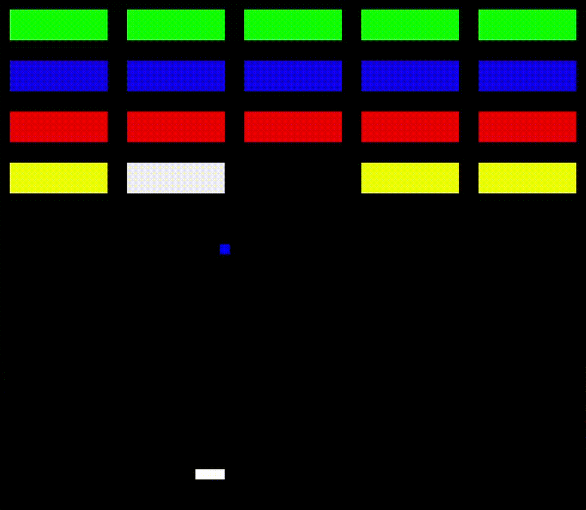
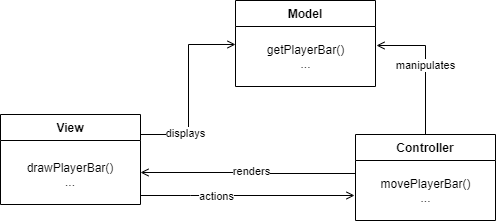
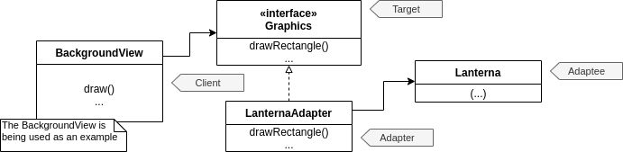
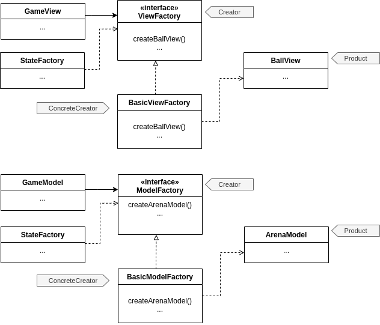
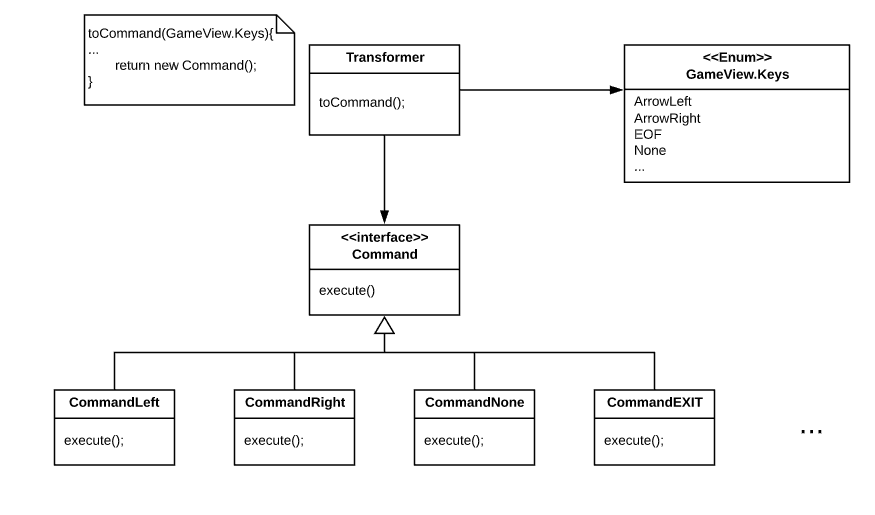
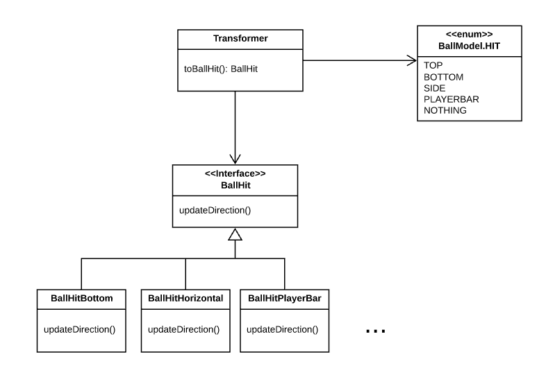
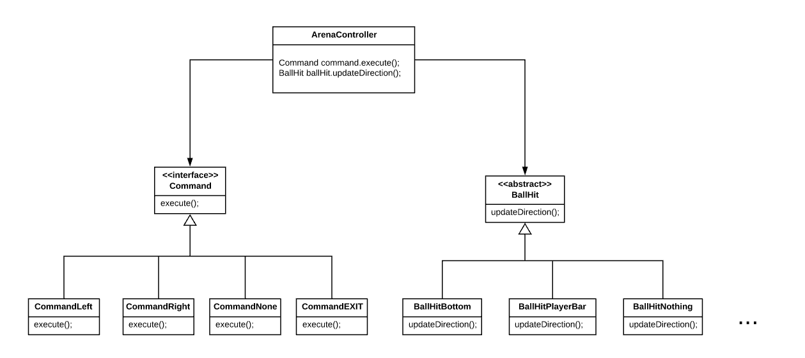

# LPOO_19 - Breakout

In this project we are creating a game that looks a lot like "Breakout". The objective is to not let the ball fall below the screen before destroying all the blocks above (by hitting them with it).

This is the current state of the project:

This project was developed by Rafael Cristino (@rafaavc, up201806680@fe.up.pt) and Xavier Pisco (@Xavier-Pisco, up201806314@fe.up.pt) for LPOO 2019/20.

## Quickly jump between topics

* [LPOO_19 - Breakout](#lpoo_19---breakout)
  * [Quickly jump between topics](#quickly-jump-between-topics)
  * [Implemented features](#implemented-features)
     * [Drawing and moving the player's bar](#drawing-and-moving-the-players-bar)
     * [Drawing and moving ball with collisions and bounces](#drawing-and-moving-ball-with-collisions-and-bounces)
     * [Drawing and checking collisions with tiles](#drawing-and-checking-collisions-with-tiles)
  * [Planned Features](#planned-features)
  * [Design](#design)
     * [<em>We want to work in the different components without affecting one another and improve modularity</em>](#we-want-to-work-in-the-different-components-without-affecting-one-another-and-improve-modularity)
     * [<em>We shouldn't need to interact directly with Lanterna to draw objects in the View</em>](#we-shouldnt-need-to-interact-directly-with-lanterna-to-draw-objects-in-the-view)
     * [<em>We want to be able to inject the classes that the ArenaView needs to create</em>](#we-want-to-be-able-to-inject-the-classes-that-the-arenaview-needs-to-create)
     * [<em>We want to convert enum types to Commands and BallHits in a simple and clean way</em>](#we-want-to-convert-enum-types-to-commands-and-ballhits-in-a-simple-and-clean-way)
     * [<em>We want our ArenaController to not have to worry about which command was given nor which object the ball hit</em>](#we-want-our-arenacontroller-to-not-have-to-worry-about-which-command-was-given-nor-which-object-the-ball-hit)
  * [Known code smells and refactoring sugestions](#known-code-smells-and-refactoring-sugestions)
     * [Large Class](#large-class)
     * [Big Switch Cases](#big-switch-cases)
     * [Lazy Class](#lazy-class)
  * [Testing](#testing)
  * [Self-evaluation](#self-evaluation)

## Implemented features

### Drawing and moving the player's bar 

The player's bar is being drawn close to the bottom of the screen and in the middle of width of the screen. 
It can be moved left or right by pressing the left or right arrows on the keyboard.

### Drawing and moving ball with collisions and bounces

The game's ball is being drawn and starts close in the middle of the width of the screen and a bit above the players bar.

The ball will move with time. In the begin it will move right up. The ball changes it's direction according to the collisions it suffers.

If the ball hits either the top of the screen, the sides of the screen, the player bar or the tiles it will bounce from that surface in the correct angle. However, if the ball hits the bottom of the screen, the game is over.

### Drawing and checking collisions with tiles

The tile grid is being generated and drawn and the collisions of the ball with the tiles are being checked. The color of the tiles depends on the amount of health they have. When a tile reaches 0 health it is removed.

## Planned Features

- [x] Draw the arena
- [x] Add the players bar
- [x] Move the bar
- [x] Draw the ball
- [x] Move the ball 
- [x] Add ball colisions and bounces
- [x] Draw the tiles
- [x] Add colisions with tiles
- [ ] Add scoreboard
- [ ] Add menus

(these are just more ideas)
- [ ] Add shots coming from above to hurt the player
- [ ] Add special powers (for example: make the ball bigger for a few seconds, make the player bar bigger, increase/decrease the ball velocity)
- [ ] Add player lives

## Design

In this section we expose some of the problems we had to face and the design patterns we used to solve them.

---

### *We want to work in the different components without affecting one another and improve modularity*

#### The problem in context

#### The pattern
- MVC (for the arena and it's various elements)

#### Implementation

The classes can be found in these files:
- Model
  - [ArenaModel](../src/main/java/com/g19/breakout/model/ArenaModel.java)
  - [ElementModel](../src/main/java/com/g19/breakout/model/ElementModel.java)
  - [BallModel](../src/main/java/com/g19/breakout/model/BallModel.java)
  - [PlayerBarModel](../src/main/java/com/g19/breakout/model/PlayerBarModel.java)
  - [TileModel](../src/main/java/com/g19/breakout/model/TileModel.java)
- View
  -  [ArenaView](../src/main/java/com/g19/breakout/view/ArenaView.java)
  -  [ElementView](../src/main/java/com/g19/breakout/view/ElementView.java)
  -  [BallView](../src/main/java/com/g19/breakout/view/BallView.java)
  -  [PlayerBarView](../src/main/java/com/g19/breakout/view/PlayerBarView.java)
  -  [TilesView](../src/main/java/com/g19/breakout/view/TilesView.java)
- Controller
  - [ArenaController](../src/main/java/com/g19/breakout/controller/ArenaController.java)

#### Consequences

---

### *We shouldn't need to interact directly with Lanterna to draw objects in the View*

#### The problem in context
The view shouldn't be interacting with the graphics directly. We don't want to have to worry about the specifics of the graphics library being used at the moment while writing the view of each component, therefore we needed to reccur to abstraction. This is also helpful if we want to have the possibility of changing the graphics library easily, while not having to worry about it in the view.

#### The pattern
We applied the **Adapter pattern**. This will enable us to have separate classes to deal with the graphics library used, while not having to worry about it while coding other features.

#### Implementation

The classes can be found in these files:
- View:
  -  [ArenaView](../src/main/java/com/g19/breakout/view/ArenaView.java)
  -  [ElementView](../src/main/java/com/g19/breakout/view/ElementView.java)
  -  [BallView](../src/main/java/com/g19/breakout/view/BallView.java)
  -  [PlayerBarView](../src/main/java/com/g19/breakout/view/PlayerBarView.java)
  -  [TilesView](../src/main/java/com/g19/breakout/view/TilesView.java)
- [Graphics](../src/main/java/com/g19/breakout/view/graphics/Graphics.java)
- [LanternaAdapter](../src/main/java/com/g19/breakout/view/graphics/LanternaAdapter.java)

#### Consequences
The use of the Adapter pattern in the current design allows for the following benefits:
- If we need to use another graphics we just need to create and use another adapter.
- Neither the model nor the view need to be changed in order to implement a new graphics.

---

### *We want to be able to inject the classes that the ArenaView needs to create*

#### The problem in context
The ArenaView was instantiating objects like BallView, PlayerBarView, etc in its constructor. This made it impossible to inject these same classes into ArenaView and violated the Single Responsibility principle for this class (it was creating and drawing the classes). We need something that allows us to solve these issues. 

#### The pattern
To solve this problem, we applied the **Abstract Factory** pattern. With this pattern we can use other classes to create the views.

#### Implementation

The classes in the diagram can be found in these files:
- [ArenaView](../src/main/java/com/g19/breakout/view/ArenaView.java)
- [ViewFactory](../src/main/java/com/g19/breakout/view/factory/ViewFactory.java)
- [BasicViewFactory](../src/main/java/com/g19/breakout/view/factory/BasicViewFactory.java)

#### Consequences

By using this design pattern:
- We can inject the factory into the ArenaView, therefore there's the possibility of injecting the BallView, PlayerBarView, etc in the tests (which we do).
- We remove the responsibility of creating those classes from the ArenaView.
- If we want we can create more implementations of the ViewFactory interface to create the views differently.
- In the future, if we want to have alternate versions of the views we only need to create a new factory for them and 'abstractify' the views.

---

### *We want to convert enum types to Commands and BallHits in a simple and clean way*

#### The problem in context

We wan't to maintain the MVC structure while the controller gets information about the view and from the model. We need the controller to know which key was pressed, and that's received by the view, but we want the controller to change that info into classes. From the model we need to know if and what the ball will hit in the next iteration.

#### The pattern
- Factory pattern - at the moment for converting enum types to Commands and BallHits 

#### Implementation

*Implementation for the controller commands received from the view*

The classes in the diagram can be found in these files:
- View:
  -  [ArenaView.Keys](../src/main/java/com/g19/breakout/view/ArenaView.java#L20)
- [Transfomer](../src/main/java/com/g19/breakout/controller/Transformer.java)
- [Commands](../src/main/java/com/g19/breakout/controller/commands)

*Implementation for the ball hits received from the model*

The classes in the diagram can be found in these files:
- View:
  -  [BallModel.HIT](../src/main/java/com/g19/breakout/model/BallModel.java#L11)
- [Transfomer](../src/main/java/com/g19/breakout/controller/Transformer.java)
- [BallHits](../src/main/java/com/g19/breakout/controller/ball)

#### Consequences

By using this design pattern in this case:
- The controller will easily convert the info received from the view and the model into classes used by it.
- Neither the view or the model will mess the MVC desing pattern already implemented.

---

### *We want our ArenaController to not have to worry about which command was given nor which object the ball hit*

#### The problem in context

We want the ArenaController to execute a command, and update the ball's direction according to which Command and BallHit the transformer has returned, respectively

#### The pattern
- Command pattern (for the Commands comming from the keyboard input and for the BallHits)

#### Implementation

Those classes can be found here:
- [ArenaController](../src/main/java/com/g19/breakout/controller/ArenaController.java#L60)
- [BallHits](../src/main/java/com/g19/breakout/controller/ball)
- [Commands](../src/main/java/com/g19/breakout/controller/commands)

#### Consequences

By using this patter the ArenaController doesn't need to know which type of command it has, it know it has a command and tells it to execute and, depending on the class implementation of the command it will execute in a diferent way.

The same can be said to the BallHit abstract class, where it saves some attributes and has a constructor for all of its subclasses and has an abstract method to update the ball's direction.

## Known code smells and refactoring sugestions

### Large Class

Our class ArenaModel it's a little bigger than all the other classes and it violates the Single Responsability Principle since it creates the arena and checks all the hits that occur in it. Maybe we can create another class to create the Arena reducing the ArenaModel's size.

### Big Switch Cases

In the Transformer class we have 2 methods and both of them have switch cases, and the one on the toBallHit() method its 22 lines long.

Even though we know that is a code smell, we think that there's no better way to do what this methods do without those switches.

### Lazy Class

The PlayerBarModel class is at the moment a lazy class. To fix this, we'll add more functionality to it like keeping the player score and the lives he has left.

The PlayerBarView and the BallView are also lazy classes. Maybe we'll need to delete them and substitute them for the ElementView class, if we don't find any other uses to put in them.

## Testing

- Screenshot of coverage report.
- Link to mutation testing report.

## Self-evaluation

- Rafael Cristino - 50%
- Xavier Pisco - 50%
